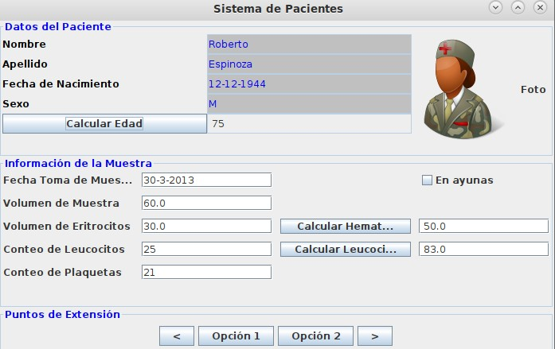

# Java
	Course: "Introducción a la programación orientada a objetos en Java"
	Universidad de los Andes.

En esta Carpeta se encuentra el projecto Final del curso, la unica intención es
mostrar el proyecto final para las personas que no han podido progresar con el mismo.

# Contenido del Curso
	- Clases y Objectos
	- Arreglos y Vectores
	- Ordenamiento
	- Herencia
	- Interfaz Gráfica
# Imagen de la Interfaz Grafica del Programa

